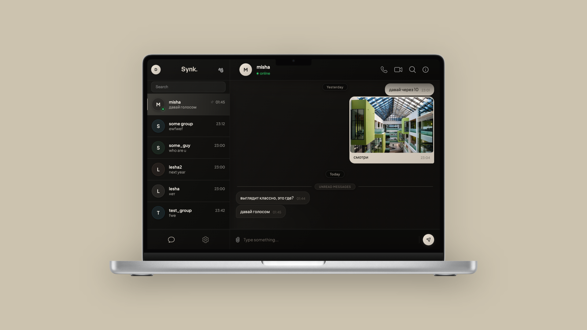
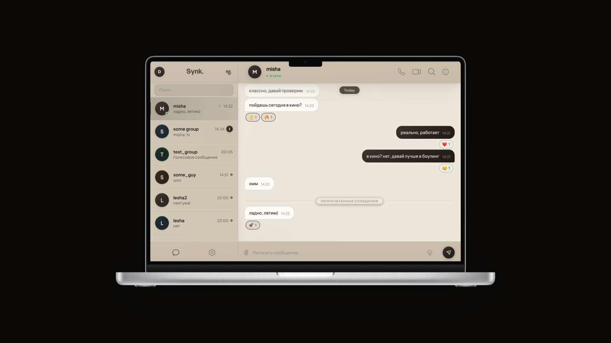
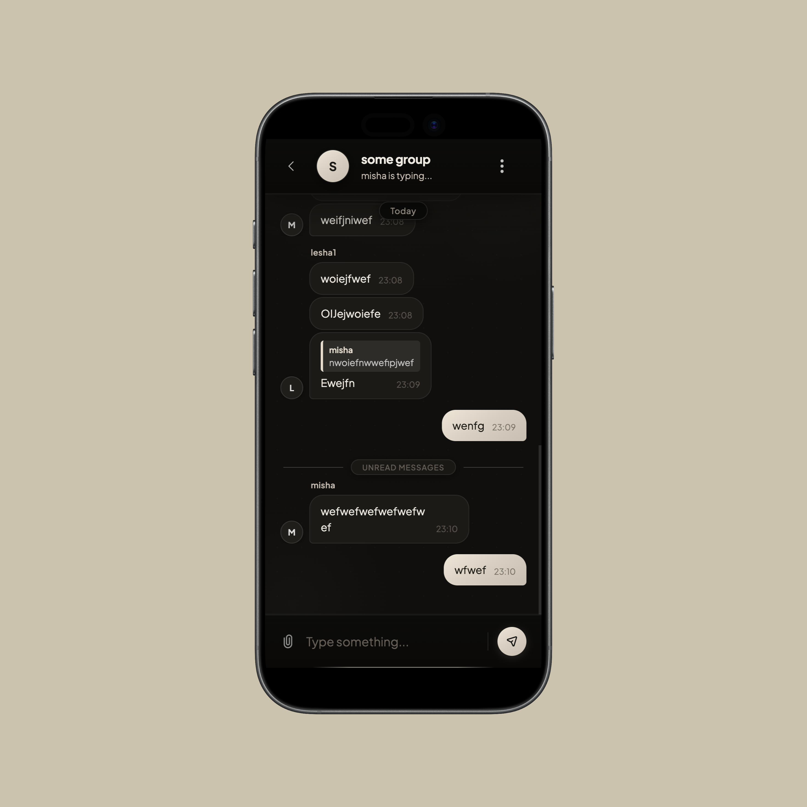

<p align="center">
  
</p>

# Synk.
Messenger App

Fullstack pet project: real-time messenger with authentication, private and group chats, message reactions, file attachments, online presence, push notifications and WebRTC call signaling.

The project is built as a production-like backend system rather than a CRUD demo. The main focus is on realtime delivery, security boundaries, state synchronization, background cleanup, observability and infrastructure-ready configuration.

## Backend Stack

- **Kotlin 2.2 + Java 21**
- **Spring Boot 4**
- **Spring Web / REST API**
- **Spring WebSocket + STOMP** for realtime chat, typing, presence and call signaling
- **Spring Security** with stateless JWT access tokens and refresh-token cookies
- **Spring Data JPA / Hibernate**
- **PostgreSQL** as the main relational database
- **Redis** for cache, rate limiting and online presence state
- **Caffeine + Redis composite cache** for local hot-path caching plus shared distributed cache
- **AWS SDK S3** for S3-compatible object storage
- **Web Push / VAPID** for browser push notifications
- **Micrometer + Actuator + Prometheus** for metrics and health checks
- **Docker Compose** for local/production-like infrastructure
- **React + TypeScript** on the frontend

## Architecture Overview

The backend is split by domain instead of by technical layer only:

```text
backend/src/main/kotlin/com/daniel/messenger
├── security   # auth, JWT, refresh tokens, cookies, rate limits
├── user       # users, profiles, avatars
├── messaging  # chats, messages, reactions, attachments, STOMP chat handlers
├── presence   # online users, heartbeats, last-seen tracking
├── call       # WebRTC call lifecycle and signaling relay
├── push       # web push subscriptions and notification delivery
├── storage    # S3-compatible object storage integration
└── config     # cache, monitoring, MVC and exception handling
```

This keeps business rules close to their domain while still sharing cross-cutting infrastructure through `config`, `security`, and small common abstractions.

## Frontend Note

The frontend is also part of the product work: the messenger UI was designed from scratch and implemented as a modern React + TypeScript application. It fully works with the backend features in this repository, including realtime chats, group flows, reactions, attachments, presence, profile/avatar updates, push notifications and call UI.

## App Mockups

<p align="center">
  
</p>

<p align="center">
  
</p>

<p align="center">
  
  
</p>

## Request Flow

```text
Client
  ├─ REST: auth, chats, messages, users, attachments
  └─ STOMP over WebSocket: chat events, typing, presence, call signaling

Spring Security
  ├─ JwtFilter for REST requests
  └─ JwtChannelInterceptor for WebSocket CONNECT frames

Domain services
  ├─ validate access and ownership
  ├─ persist state in PostgreSQL
  ├─ cache hot checks in Caffeine/Redis
  └─ publish realtime updates through SimpMessagingTemplate

Infrastructure
  ├─ Redis: rate limits, presence, cache
  ├─ S3: attachments and avatars
  └─ Prometheus: runtime metrics
```

## Notable Backend Decisions

### Stateless Auth With Refresh Rotation

The REST API is protected by a custom JWT filter and Spring Security. Access tokens are short-lived, while refresh tokens are stored server-side and sent through HTTP-only cookies. This keeps request authentication stateless while still allowing session invalidation and refresh-token cleanup.

### WebSocket Security Is Not an Afterthought

WebSocket traffic has its own inbound channel pipeline:

- `JwtChannelInterceptor` authenticates STOMP connections.
- `WsRateLimitInterceptor` rate-limits noisy realtime actions.
- `SubscriptionAuthInterceptor` blocks subscriptions to chats where the user is not a participant.

That means authorization is enforced both on REST endpoints and on realtime subscriptions.

### Redis-backed Rate Limiting

Login/register endpoints and high-frequency STOMP destinations are protected with Redis counters and Lua scripts. The Lua script makes increment + expiry atomic, which avoids race conditions under concurrent requests.

Examples:

- `/api/auth/login`
- `/api/auth/register`
- `/app/chat.send`
- `/app/chat.typing`
- `/app/presence.heartbeat`
- `/app/call.signal`

### Presence Built for Multiple Connections

Presence is not just a boolean flag. The backend tracks connection counts per user, heartbeat TTLs, and stale-user eviction:

- multiple tabs/devices do not mark a user offline too early;
- heartbeats keep online state fresh;
- a scheduled job evicts stale users and updates `lastSeenAt`;
- online-user count is exported as a Prometheus metric.

### Attachment Storage and Cleanup

Files are uploaded to S3-compatible storage, while metadata remains in PostgreSQL. Deletion from S3 is asynchronous, and orphaned attachments are cleaned by a scheduled job. This separates transactional DB state from eventually consistent object storage cleanup.

### Realtime Chat Model

Chat operations are split between REST and STOMP:

- REST handles durable operations and paginated reads.
- STOMP handles low-latency events: messages, edits, deletes, reactions, typing and read updates.

The backend uses service-level access checks, ownership validation and participant validation before broadcasting events.

### Observability

The service exposes Spring Actuator endpoints and Prometheus metrics. Custom metrics include current online users through Micrometer. Docker Compose includes Prometheus and Grafana provisioning, so runtime behavior can be inspected instead of guessed.

## Backend Features

- Registration and login
- JWT access tokens + refresh-token cookies
- Private and group chats
- Message pagination and search
- Message edit/delete flow
- Reactions
- Read acknowledgements
- Typing indicators
- Online/offline presence and last-seen timestamps
- File, media and avatar uploads through S3-compatible storage
- Push notification subscriptions and delivery
- WebRTC call initiation and signaling relay
- TURN credential generation
- Redis-backed HTTP and WebSocket rate limits
- Scheduled cleanup for refresh tokens, stale presence and orphaned attachments
- Centralized exception handling
- Health checks and Prometheus metrics

## Running Locally

Create an environment file:

```bash
cp .env.example .env
```

Fill in the required secrets and storage values, then start the infrastructure and services:

```bash
docker compose up --build
```

For backend-only development:

```bash
cd backend
./mvnw spring-boot:run
```

The backend expects PostgreSQL and Redis to be available, and reads sensitive values from environment variables. Real secrets should stay in `.env`, IDE run configs, CI secrets or deployment secrets.

## Useful Endpoints

- `POST /api/auth/register`
- `POST /api/auth/login`
- `POST /api/auth/refresh`
- `GET /actuator/health`
- `GET /actuator/prometheus`
- `WebSocket /ws`

## Configuration

The main backend config is intentionally environment-driven:

- `JWT_SECRET`
- `DB_USERNAME`
- `DB_PASSWORD`
- `APP_CORS_ALLOWED_ORIGINS`
- `APP_COOKIE_SECURE`
- `TURN_SECRET`
- `TURN_URL`
- `S3_ACCESS_KEY`
- `S3_SECRET_KEY`
- `S3_REGION`
- `S3_ENDPOINT`
- `S3_BUCKET`
- `S3_FETCH_URL`
- `VAPID_PUBLIC_KEY`
- `VAPID_PRIVATE_KEY`
- `VAPID_SUBJECT`

See `.env.example`, `backend/.env.example`, and `backend/src/main/resources/application.yaml.example` for the full list.

## Why This Project Is Interesting

This project touches several problems that appear in real backend systems:

- securing both HTTP and WebSocket surfaces;
- modeling realtime events without losing durable state;
- keeping presence correct across reconnects and multiple tabs;
- using Redis for atomic coordination, not only as a cache;
- separating database metadata from object storage lifecycle;
- adding observability early enough for operational debugging;
- keeping configuration public-safe and deployment-ready.

The result is a compact messenger backend that demonstrates not only framework usage, but also system-design decisions around realtime communication, consistency boundaries, security and operations.
